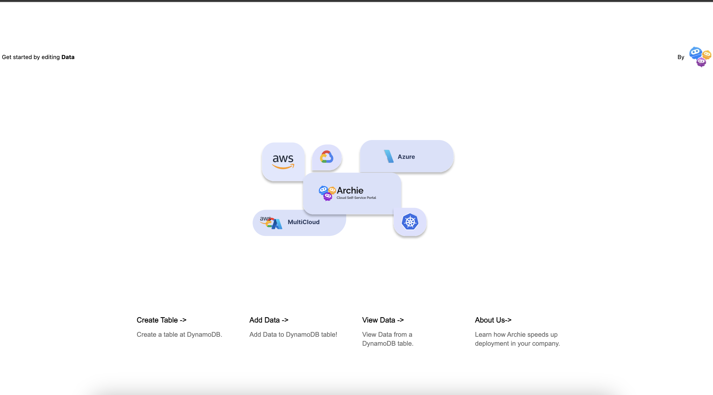
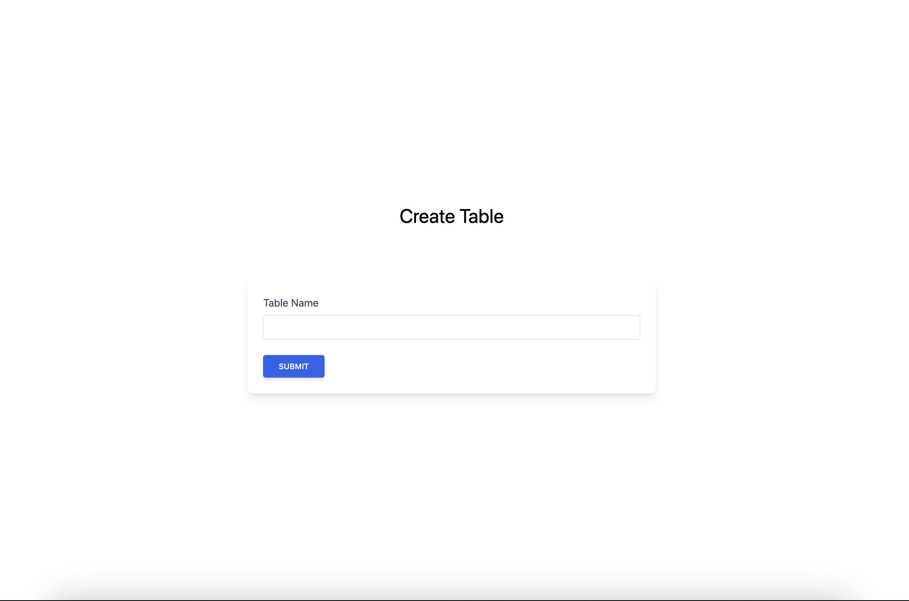
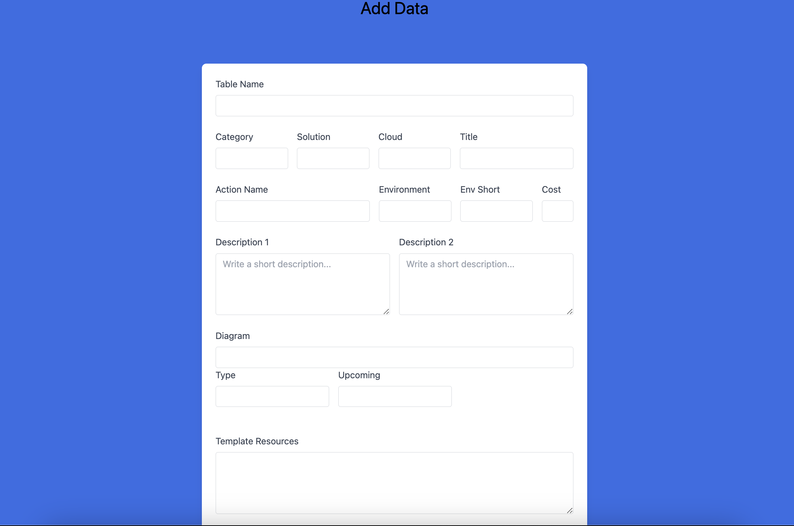
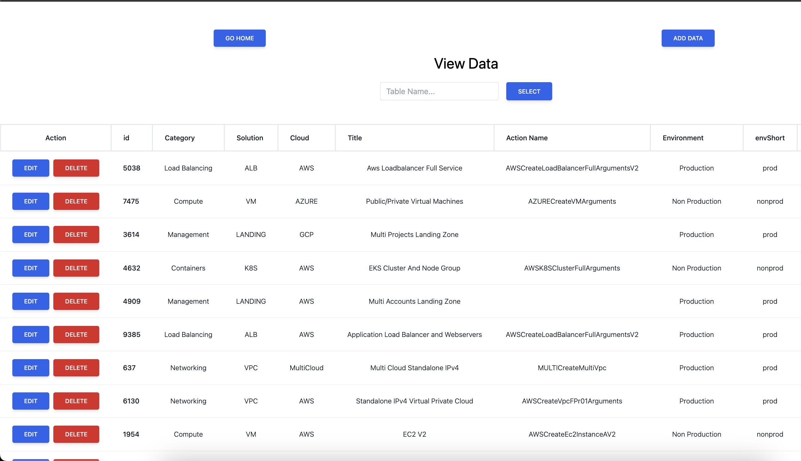
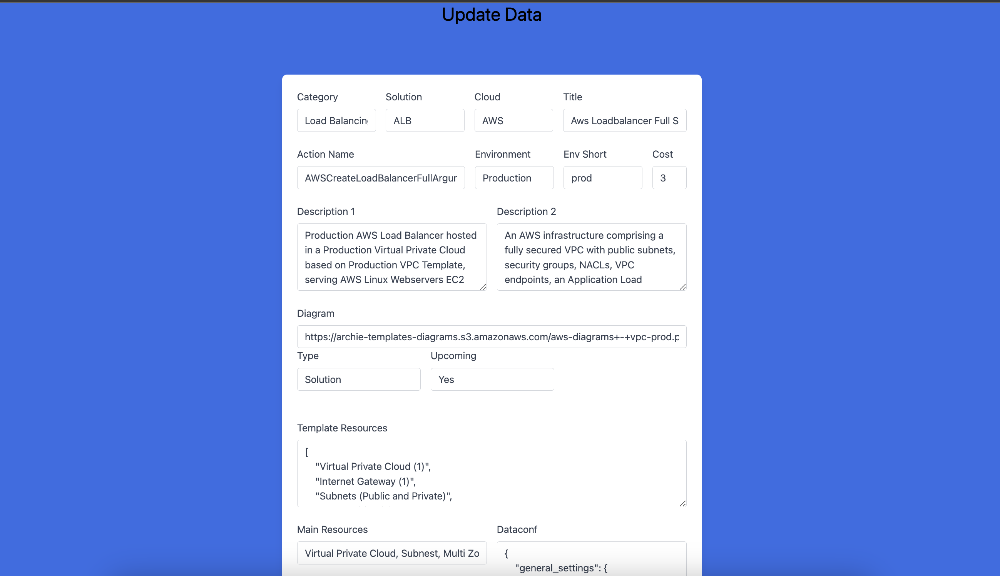

# AWS Crud for Archie

This is a [Next.js](https://nextjs.org/) project bootstrapped with [`create-next-app`](https://github.com/vercel/next.js/tree/canary/packages/create-next-app).

Original repo from [sankharr](https://github.com/sankharr/aws_crud)

## Features

- [x] Create a new table
- [x] Read from a table
- [x] Update a table
- [x] Delete a record from a table

## Notes 🟡

* This project is a work in progress. Only works in local developer mode with DynamoDB and AWS credentials are required.

* This project uses [`next/font`](https://nextjs.org/docs/basic-features/font-optimization) to automatically optimize and load Inter, a custom Google Font.

## Getting Started

1 - Clone the repository

    ```bash
    git clone https://github.com/hharieta/aws_crud_archie.git
    cd aws_crud_archie
    ```

2 - Set up your AWS credentials: Create a .env file at the root of the project and add your AWS credentials

    ```bash
    # Create a .env file at the root of the project
    NEXT_PUBLIC_AWS_ACCESS_KEY_ID="xxxxxxxxxxxxxxxxxxxx"
    NEXT_PUBLIC_AWS_SECRET_ACCESS_KEY="xxxxxxxxxxxxxxxxxxxxxxxxxxxxxxxxxxxxxxxx"
    ```

3 - Run the development server:

    ```bash
    yarn install
    yarn dev
    ```

4- Open [http://localhost:3002](http://localhost:3002) with your browser to see the result.


## How to use



1. Create a new table

    

2. populate the table

    

3. Read from the table
    
    

4. Update a record. Push Edit button from the rocords list

    

5. For delete a record push the delete button from the records list
